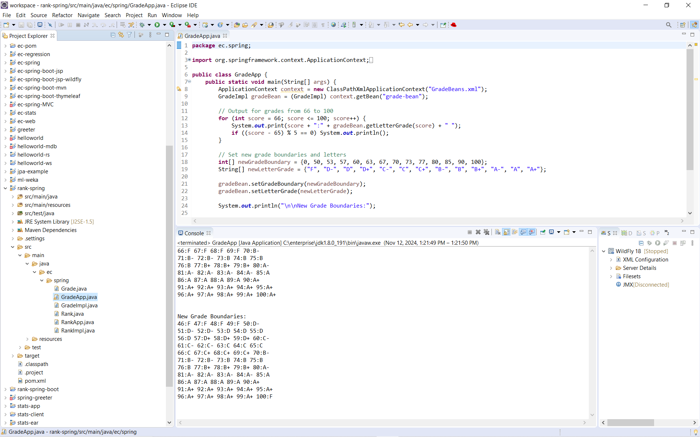
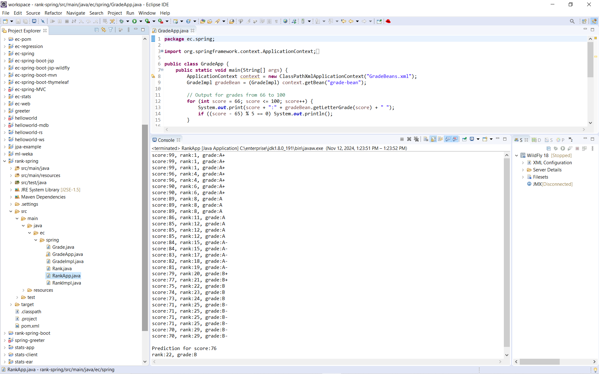
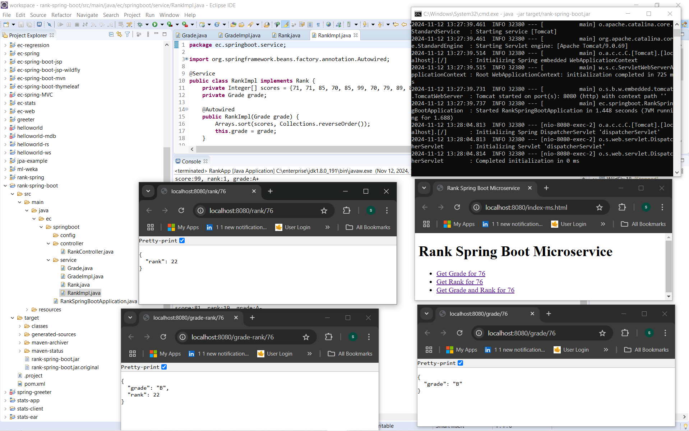

### Spring Grade & Rank Services

    A full-stack Spring-based platform showcasing configurable grading logic, student ranking computation, and RESTful microservices deployment.
    This project evolves from traditional Spring Bean configuration to modern Spring Boot and Dockerized microservices, demonstrating code reuse, IoC, REST APIs, and lightweight deployment pipelines.

### 🧩 Project Overview

    The platform implements a Grade and Rank computation system in three progressive layers:

       - rank-spring – Classic Spring XML configuration with IoC and bean wiring.

       - rank-spring-boot – REST microservice built with Spring Boot, exposing /grade and /rank endpoints.

       - rank-spring-boot-ms – Containerized version of the microservice using Docker for isolated deployment.

    Each layer reuses the same business logic (GradeImpl, RankImpl) to illustrate modular Spring application design.

### 📁 Project Structure
    ```bash
    Spring-grade-rank-services/
    ├── images/                      # Proof of outputs and UI snapshots
    │   ├── grade-spring-bean.PNG
    │   ├── rank-spring-bean.PNG
    │   ├── rank-spring-boot-microservice.PNG
    ├── rank-spring/                 # Classic Spring configuration
    │   └── src/main/java/ec/spring/
    │       ├── Grade.java
    │       ├── GradeImpl.java
    │       ├── GradeApp.java
    │       ├── Rank.java
    │       ├── RankImpl.java
    │       └── RankApp.java
    ├── rank-spring-boot/            # Spring Boot microservice
    │   └── src/main/java/ec/springboot/
    │       ├── config/
    │       ├── controller/
    │       └── service/
    └── rank-spring-boot-ms/         # Docker-enabled microservice

    ```
---

### ⚙️ 1. Classic Spring Bean Application

        🧠 Core Concepts

            Dependency Injection (IoC): GradeBeans.xml defines all grade and rank beans.

            Loose Coupling: Grade logic can be modified externally without touching Java code.

            Console Output Validation: Automatically prints letter grades and rank predictions.

        ▶️ Run Instructions
```           
            cd rank-spring
            mvn clean package
            java -cp target/rank-spring.jar ec.spring.GradeApp
```
        📸 Output Proof

           

           - Grade Boundary & Update Demo:

           - Rank Calculation Output:

        The console output confirms both grade computation and dynamic reconfiguration of grade boundaries through Spring’s bean container.


### 🌐 2. Spring Boot REST Microservice

        🧠 Core Features
           - Exposes endpoints to compute grades and ranks in real time.
           - Uses the same service logic (RankImpl, GradeImpl) now wired with Spring Boot’s annotation-based configuration.
           - Includes an interactive HTML page for API testing.

        📡 REST Endpoints
            Endpoint	Description	Example Output
            /grade/{score}	Returns letter grade	{ "grade": "B" }
            /rank/{score}	Returns student rank	{ "rank": 22 }
            /grade-rank/{score}	Combined result	{ "grade": "B", "rank": 22 }
            /index-ms.html	HTML testing page	Links to all API endpoints

        ▶️ Run Instructions
           - cd rank-spring-boot
           - mvn clean package
           - java -jar target/rank-spring-boot.jar


        Access the service at:
        👉 http://localhost:8080/index-ms.html

        📸 Output Proof

         

        The screenshot shows successful REST API responses for grade and rank retrievals, confirming JSON serialization and endpoint routing.


### 🐳 3. Dockerized Microservice (rank-spring-boot-ms)

        🧱 Overview

            This stage containerizes the Spring Boot microservice for consistent deployment across environments.

        🧰 Docker Setup

            Create Dockerfile in rank-spring-boot-ms/:
            FROM openjdk:17-jdk-slim
            WORKDIR /app
            COPY target/rank-spring-boot.jar app.jar
            EXPOSE 8080
            ENTRYPOINT ["java","-jar","app.jar"]


        Build and Run Container

            cd rank-spring-boot-ms
            docker build -t spring-grade-rank-ms .
            docker run -d -p 8080:8080 spring-grade-rank-ms


        Verify

            curl http://localhost:8080/grade/76
            curl http://localhost:8080/rank/76



        The containerized build ensures identical performance and behavior across developer machines, CI/CD pipelines, and production environments.


### 🔧 Configuration & Setup Notes
    System Variables

    Ensure the following environment variables are set for seamless builds:

    JAVA_HOME     = C:\Program Files\Java\jdk-17
    MAVEN_HOME    = C:\apache-maven-3.9.9
    DOCKER_HOME   = C:\Program Files\Docker


    Add their /bin directories to your PATH, then verify:

    java -version
    mvn -v
    docker --version

    Directory Consistency

### ⚠️ Important: Keep the project structure as-is 

    (C:\enterprise\workspace\ec-git-projects\Spring-grade-rank-services) to prevent classpath and build reference issues.

### 🧭 Key Takeaways

    Demonstrates the evolution of Spring development — from XML beans to Boot annotations and Dockerized services.

    Clean architecture and code reuse between modules.

    Container-ready, minimal configuration, and portable.

    Ideal reference for interviews, DevOps setups, or microservice practice.

### 🧪 Future Enhancements

    Add unit tests using JUnit 5.

    Integrate Swagger/OpenAPI documentation.

    Enable CI/CD build via GitHub Actions.

    Extend microservice to handle bulk score uploads via JSON.

### 📘 Summary

    Spring Grade & Rank Services bridges foundational Spring learning with production-ready microservice deployment.
    It demonstrates a professional, layered approach to Java development — from beans to REST to Docker.